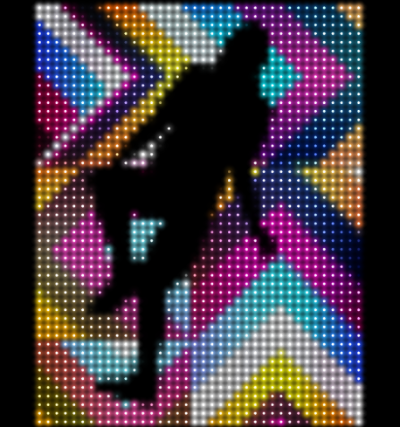
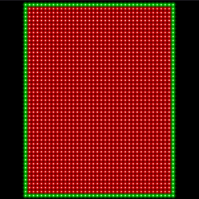
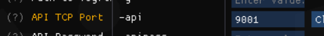

# Spicetools DANCERUSH Pad Interface

This little blob of javascript communicates with the websocket API of Spicetools
to both display the pad LEDs of DANCERUSH, as well as control the foot inputs
(with multitouch support). It is best used on a separate touchscreen laptop or
phone, to maximise your finger-dancing vibes.

A great deal of effort has gone into making the LEDs look realistic, mainly
regarding colours saturating to white.

It uses PixiJS for rendering, and a standard WebSocket for comms.

## Setup
When you open the .html (no webserver needed), you'll see the default light
pattern:

Setup spicetools to expose the API on a specific port. I used port 9001 (which
will expose the "real" API on 9001, and the websocket API on 9002). This can be done via the commandline with the `-api 9001` flag, or via spicecfg.exe:

Run the game, and the virtual pad should turn black as the connection is
established. From here, it should "just work". Click or touch the virtual pad to
send inputs to the game.

## Known bugs
Sometimes feet get stuck, which is much more common on devices with limited CPU
(such as phones). I never really investigated good ways to fix this. PRs
welcome.
